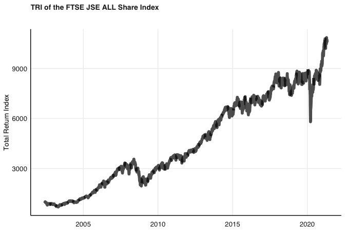
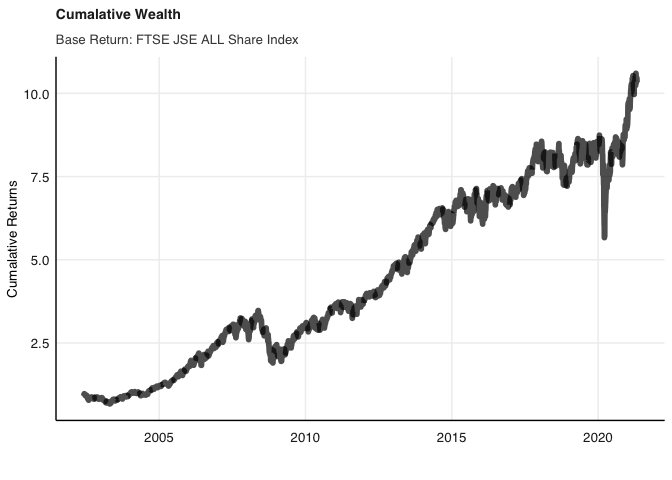
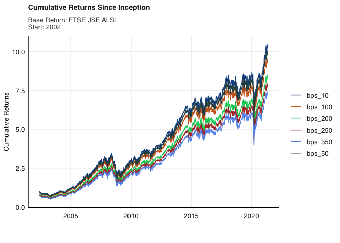
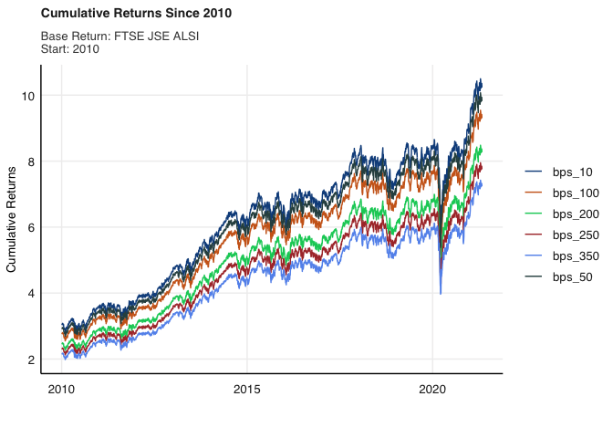

README
================
20903936
8/26/2021

# Purpose

The purpose of this assignment is to replicate two graphs showing the
impact of various management fees on the cumulative investor wealth.

``` r
#Checking for missing values

sum(is.na(data$TRI)) #no missing TRI values
```

    ## [1] 0

Plotting the TRI return series to get a view of the data

``` r
p <-  data  %>% arrange(date) %>%
     ggplot() + 
  
  geom_line(aes(date,TRI), size = 2, alpha = 0.7) +
    
      fmxdat::theme_fmx(title.size = ggpts(30),
                  subtitle.size = ggpts(28),
                   caption.size = ggpts(25),
                     #Makes nicer caption. If no caption given, this will break function, so careful:
                  CustomCaption = F) +

  fmxdat::fmx_cols() + 
  
  labs(x = "", y = "Total Return Index",
       title = "TRI of the FTSE JSE ALL Share Index",
       subtitle = "") +
  
  guides(color = F)

#uncomment if you want to show in 2 year interval
#fmxdat::finplot(p, x.vert = T, x.date.type = "%Y", x.date.dist = "2 years")

p
```

<!-- -->

Having plotted the series, now I will transform the series to a log
cumulative return series.

``` r
data2 <- data %>% arrange(date) %>% mutate(Returns = TRI/lag(TRI) - 1) %>% filter(date>first(date))%>% mutate(cum_ret=cumprod(1 + Returns))

z <-  data2  %>% arrange(date) %>%
     ggplot() + 
  
  geom_line(aes(date,cum_ret), size = 2, alpha = 0.7) +
    
      fmxdat::theme_fmx(title.size = ggpts(30),
                  subtitle.size = ggpts(28),
                   caption.size = ggpts(25),
                     #Makes nicer caption. If no caption given, this will break function, so careful:
                  CustomCaption = F) +

  fmxdat::fmx_cols() + 
  
  labs(x = "", y = "Cumalative Returns",
       title = "Cumalative Wealth",
       subtitle = "Base Return: FTSE JSE ALL Share Index") +
  
  guides(color = F)

#uncomment if you want to show in 2 year interval
#fmxdat::finplot(p, x.vert = T, x.date.type = "%Y", x.date.dist = "2 years")

z
```

<!-- -->

Now I wish to remove management fees from the returns to show the impact
of the fees on wealth.

``` r
data3 <- data2 %>% 
  mutate(bps_10=(cum_ret* (1 - 0.01)))%>%
  mutate(bps_50=(cum_ret* (1 - 0.05)))%>%
  mutate(bps_100=(cum_ret* (1- 0.10)))%>%
  mutate(bps_200=(cum_ret*(1 - 0.20)))%>%
  mutate(bps_250=(cum_ret* (1 - 0.25)))%>%
  mutate(bps_350=(cum_ret* (1- -0.30)))
```

Plotting the series since inception

``` r
data4 <- data3 %>%
  arrange(date)%>%
  pivot_longer(cols=starts_with("bps"), 
               names_to="Type",
               values_to="Tyranny" )
  
blah2002 <-
    ggplot(data4) + 
geom_line(aes(date, Tyranny, colour=Type)) + 
    
fmxdat::theme_fmx(title.size = ggpts(30), 
                    subtitle.size = ggpts(28),
                    caption.size = ggpts(25),
                    CustomCaption = F,
                  legend.size = 10,
                  legend.pos = "right") + 
    fmxdat::fmx_cols() + 
  
  labs(x = "", y = "Cumulative Returns", caption = "",
       title = "Cumulative Returns Since Inception",
       subtitle = "Base Return: FTSE JSE ALSI \nStart: June 2002")

blah2002
```

<!-- -->

Plotting the series since 2010

``` r
data5 <- data3 %>%
  arrange(date)%>% filter(date>lubridate::ymd(20100101))%>%
  pivot_longer(cols=starts_with("bps"), 
               names_to="Type",
               values_to="Tyranny" )
  
blah2010 <-
    ggplot(data5) + 
geom_line(aes(date, Tyranny, colour=Type)) + 
    
fmxdat::theme_fmx(title.size = ggpts(30), 
                    subtitle.size = ggpts(28),
                    caption.size = ggpts(25),
                    CustomCaption = F,
                  legend.size = 10,
                  legend.pos = "right") + 
    fmxdat::fmx_cols() + 
  
  labs(x = "", y = "Cumulative Returns", caption = "",
       title = "Cumulative Returns Since 2010",
       subtitle = "Base Return: FTSE JSE ALSI \nStart: 2010")

blah2010
```

<!-- -->
